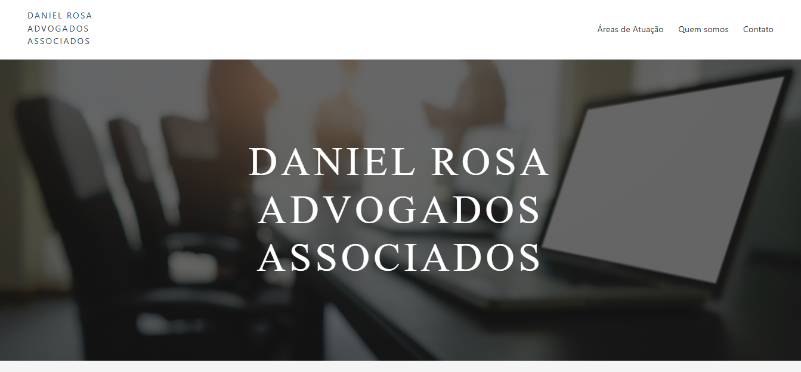
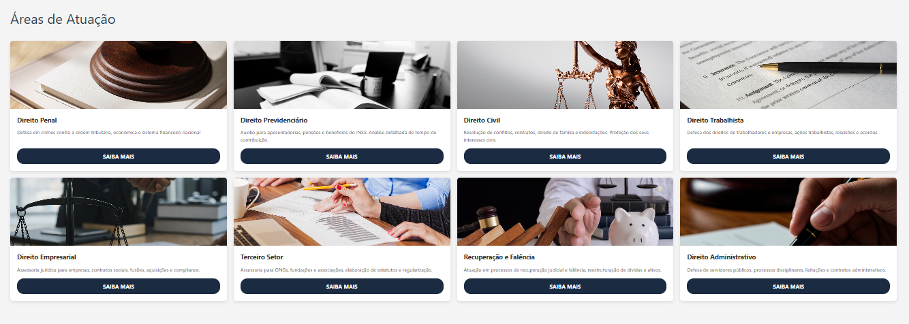

# ⚖️ Advocacia Daniel Rosa

> Landing Page responsiva desenvolvida para apresentação institucional de escritório de advocacia.

🔗 **[CLIQUE AQUI PARA VER O SITE ONLINE](https://danielrosaadvogado.netlify.app/)**

## 🖥️ Sobre o Projeto
Este projeto simula a presença digital de um escritório de advocacia, focando em transmitir credibilidade, seriedade e facilidade de contato. O layout foi pensado para guiar o usuário desde a apresentação do profissional até a conversão (contato).




## 🚀 Tecnologias Utilizadas
* **HTML5 Semântico:** Para melhor SEO e acessibilidade.
* **CSS3:** Uso de Flexbox e Grid Layout para responsividade total (Mobile First).
* **JavaScript:** Interatividade no slider de serviços e manipulação do DOM.
* **Git & GitHub:** Controle de versão.

## ✨ Funcionalidades
- [x] Menu de navegação responsivo
- [x] Slider interativo para áreas de atuação
- [x] Botão de WhatsApp flutuante
- [x] Animações suaves de transição

## 📂 Como rodar localmente
1. Clone o repositório:
   ```bash
   git clone [https://github.com/luckasdz7/site-advocacia-daniel.git](https://github.com/luckasdz7/site-advocacia-daniel.git)